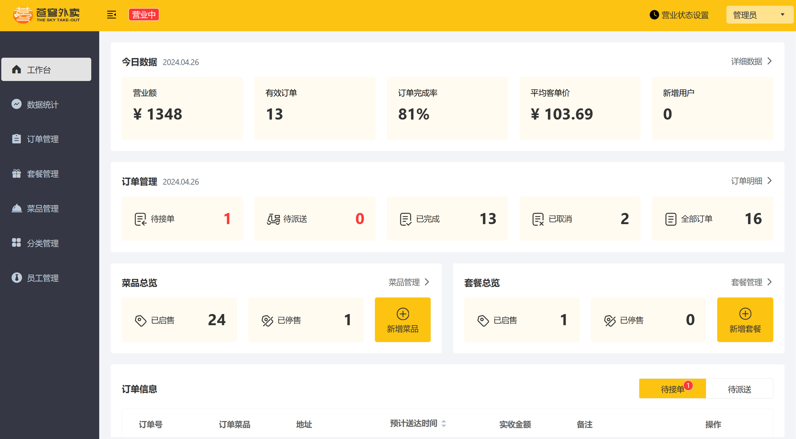
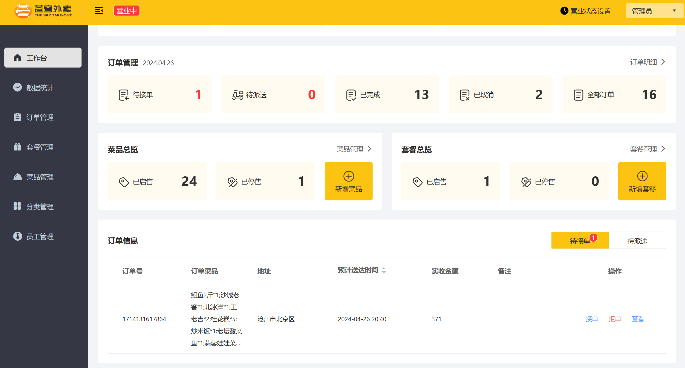
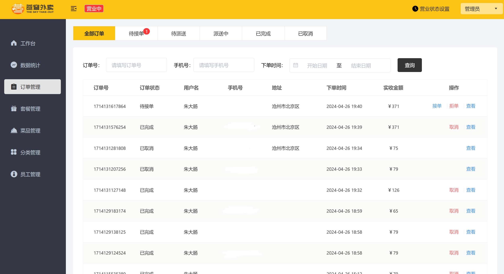
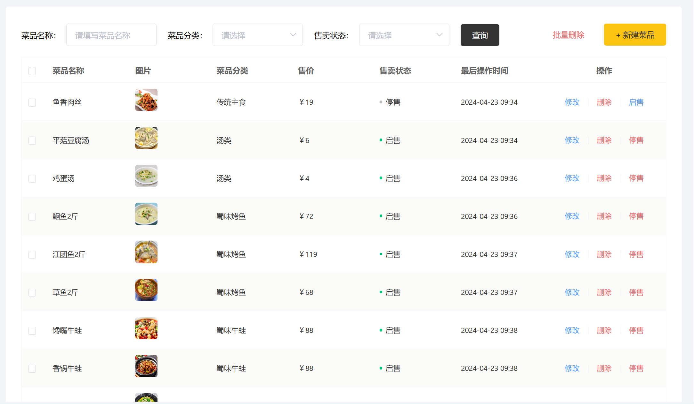

# 苍穹外卖 Sky-Take-Out

## 技术栈

SpringBoot+Mysql+Vue3+WebSocket+Redis+ElementUI

## 环境搭建

- **前端**
  - Web文件夹下运行nginx.exe文件
- 后端
  - 更改sky-server里面的application-dev.yml文件内容
  - 首次构建前，注册一次 JDK 11 的 Maven toolchain（`mvn` 需要它才能正确编译，尤其是本机默认 JDK 版本不是 11 的情况下）：
    - macOS / Linux: `./scripts/setup-toolchain.sh`
    - Windows: `powershell -ExecutionPolicy Bypass -File scripts\setup-toolchain.ps1`
- 数据库
  - 运行sky_take_out.sql

## 项目截图

- 

- 
- 
- 
- 