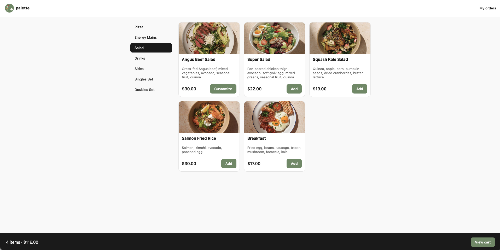
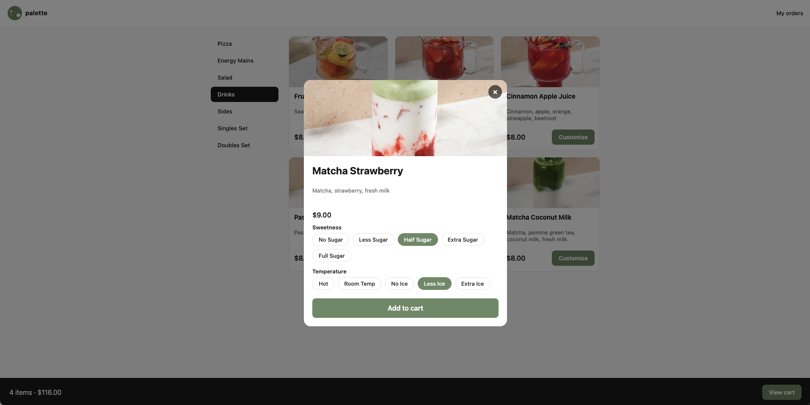
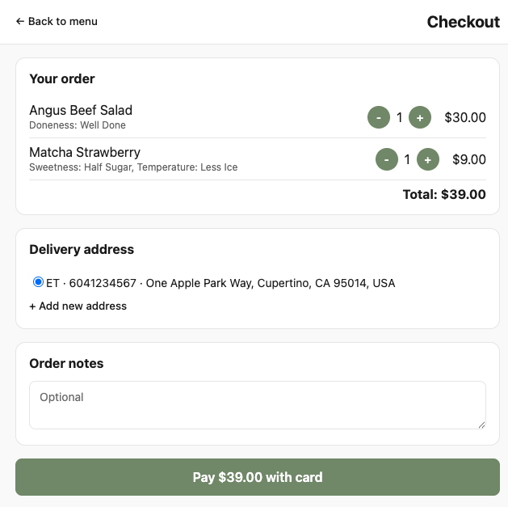
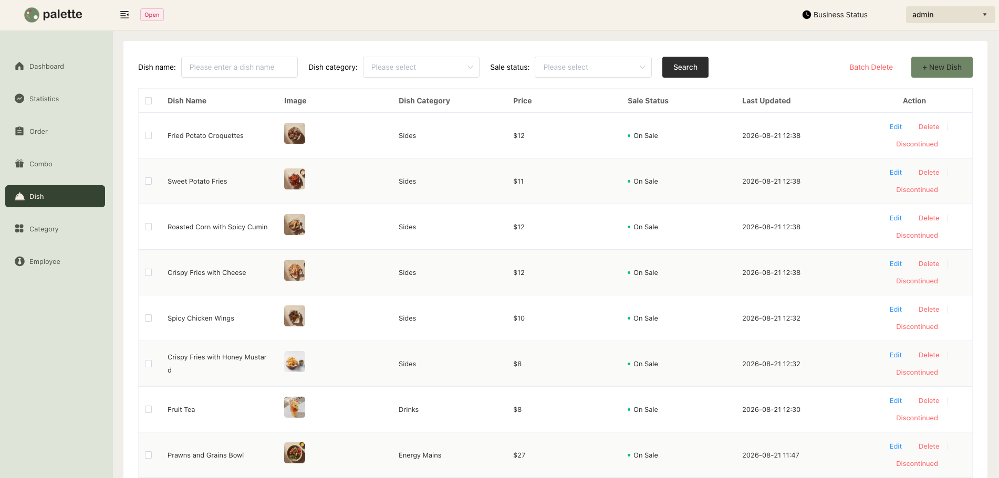
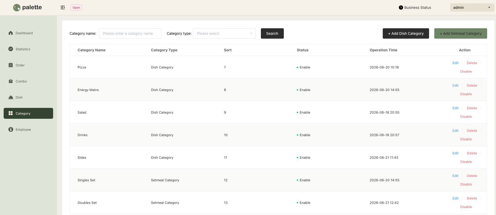
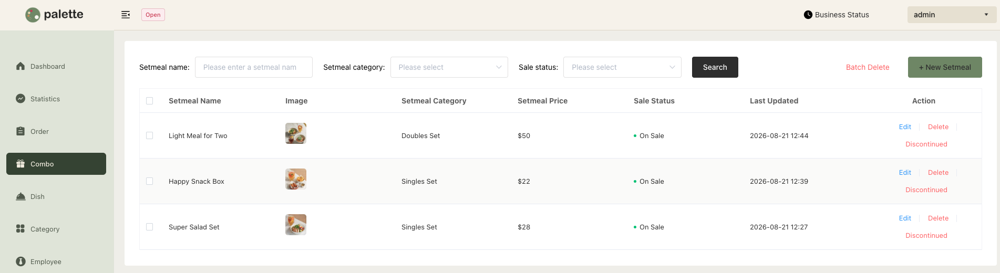

# Palette

Online ordering system for Palette, a kitchen and juice bar.

## Tech Stack

SpringBoot + MySQL + Vue3 + WebSocket + Redis + ElementUI

## Getting Started

- **Customer Frontend**
  - See `customer-web`'s README
- **Admin Frontend**
  - See `deploy/README.md` — it's a pre-built static app, served via nginx (or any static server) proxying to the backend
- **Backend**
  - Copy `palette-server/src/main/resources/application-dev.yml.example` to `application-dev.yml` in the same folder and fill in your own database, OSS, and Stripe credentials (this file is gitignored)
  - Before the first build, register a JDK 11 Maven toolchain once (`mvn` needs it to compile correctly, especially if your machine's default JDK isn't 11):
    - macOS / Linux: `./scripts/setup-toolchain.sh`
    - Windows: `powershell -ExecutionPolicy Bypass -File scripts\setup-toolchain.ps1`
- **Database**
  - Run `palette.sql`

## Screenshots

### Customer Web (customer-web)

- 
- 
- 

### Admin Backend

- 
- 
- 
